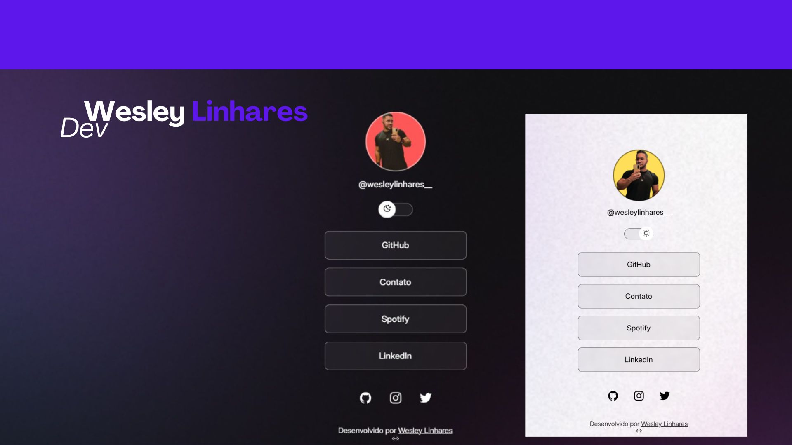

<h1 align="center"> Projeto Ponto Doce </h1>

Um projeto para uma empresa do ramo de doceria.

  <!--  -->

## 🚀 Tecnologias

Esse projeto foi desenvolvido com as seguintes tecnologias:

- HTML e CSS
- JavaScript
- Git e Github
- Figma
- Canva

## 💻 Projeto

Criação de um modelo de Social Links que serve como agregador de links para usar como cartão de visitas online.

---

Feito com ♥ by Wesley Linhares :wave: [Entre em contato](https://instagram.com/wesleylinhares__)